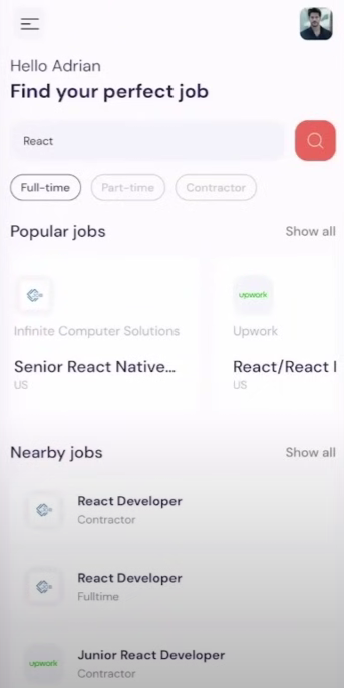
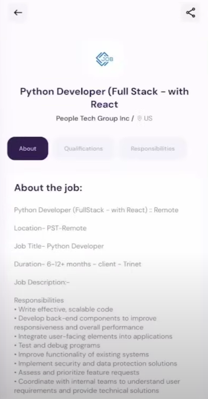
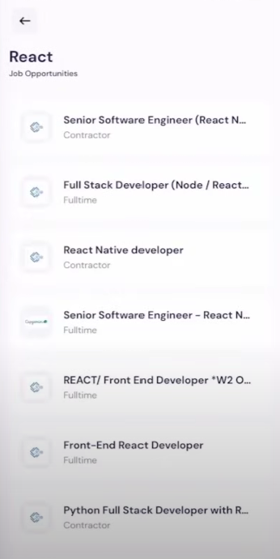

# React.js-Typescript-QuizApp

## Table of content

&nbsp;&nbsp;&nbsp; [About Project](#about-project)\
&nbsp;&nbsp;&nbsp; [Screenshots](#screenshots)\
&nbsp;&nbsp;&nbsp; [Technologies Used](#technologies-used)\
&nbsp;&nbsp;&nbsp; [Prerequisites](#prerequisites)\
&nbsp;&nbsp;&nbsp; [Installation](#installation)\
&nbsp;&nbsp;&nbsp; [Usage](#usage)\
&nbsp;&nbsp;&nbsp; [Acknowledgments](#acknowledgments)

## About Project

This is a React Native Job Portal that utilizes [JSearch API](https://rapidapi.com/letscrape-6bRBa3QguO5/api/jsearch/)

## Screenshots

## Technologies Used

- React Native
- ESLint
- Prettier

## Prerequisites

You will need to have Node.js and npm installed on your machine.

## Installation

To get started with this project, follow the steps below:

1. Clone the repository to your local machine:\
   &nbsp;&nbsp;&nbsp;&nbsp;&nbsp;&nbsp; `git clone https://github.com/yshvchnk/ReactNative-JobPortal.git`

2. Navigate to the project directory:\
   &nbsp;&nbsp;&nbsp;&nbsp;&nbsp;&nbsp; `cd ReactNative-JobPortal`

3. Install dependencies:\
   &nbsp;&nbsp;&nbsp;&nbsp;&nbsp;&nbsp; `npm install`

4. Start the development server:\
   &nbsp;&nbsp;&nbsp;&nbsp;&nbsp;&nbsp; `npm start`

## Usage

Open [http://localhost:8081](http://localhost:8081) with your browser to see the result.

## Acknowledgments

This project was bootstrapped with [Expo](https://expo.dev/).
Use [`expo-router`](https://expo.github.io/router) to build native navigation using files in the `app/` directory.

- [Expo Router: Docs](https://expo.github.io/router)
- [Expo Router: Repo](https://github.com/expo/router)
